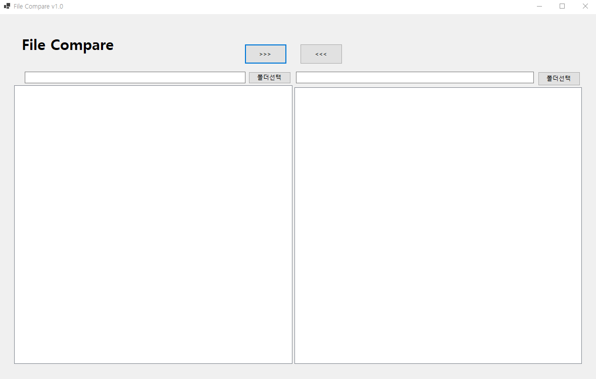
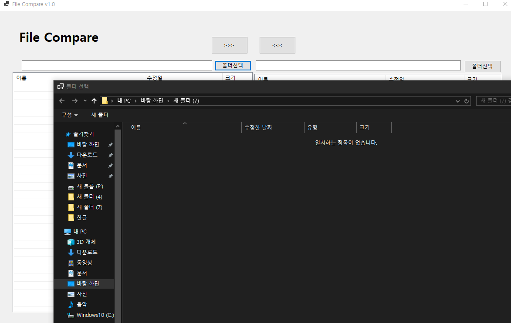
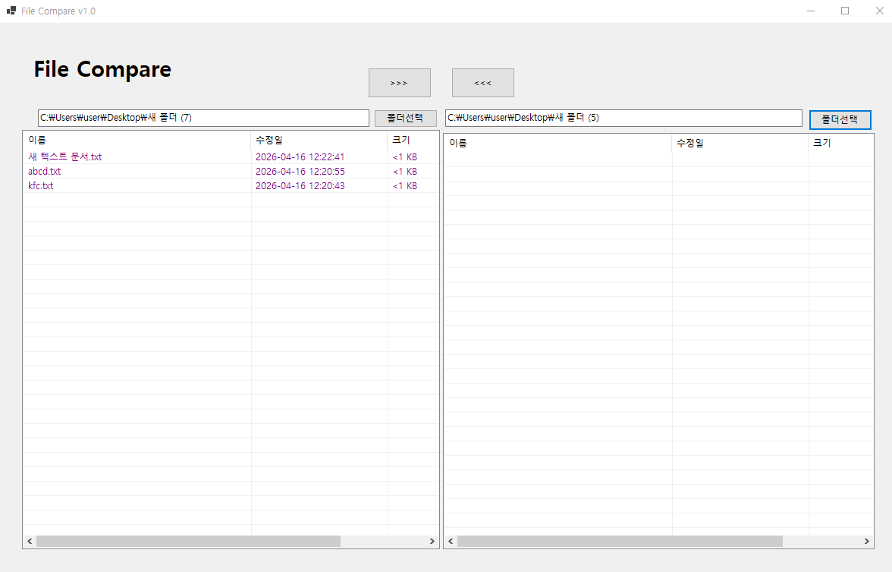
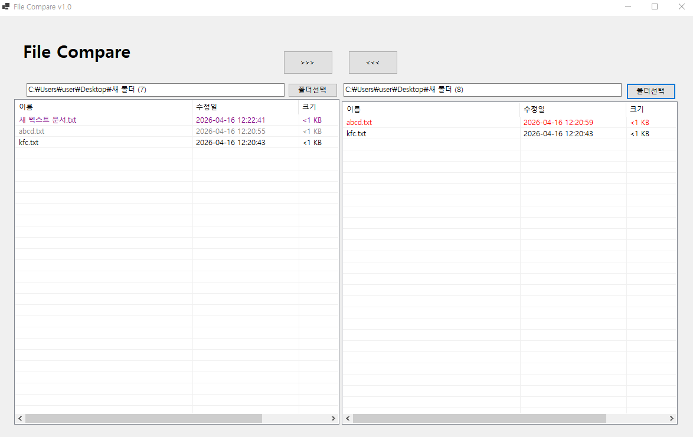
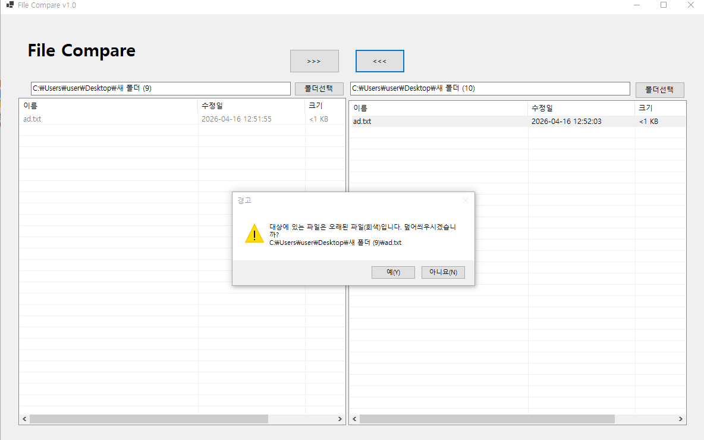
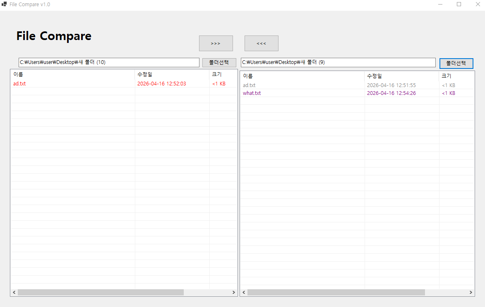
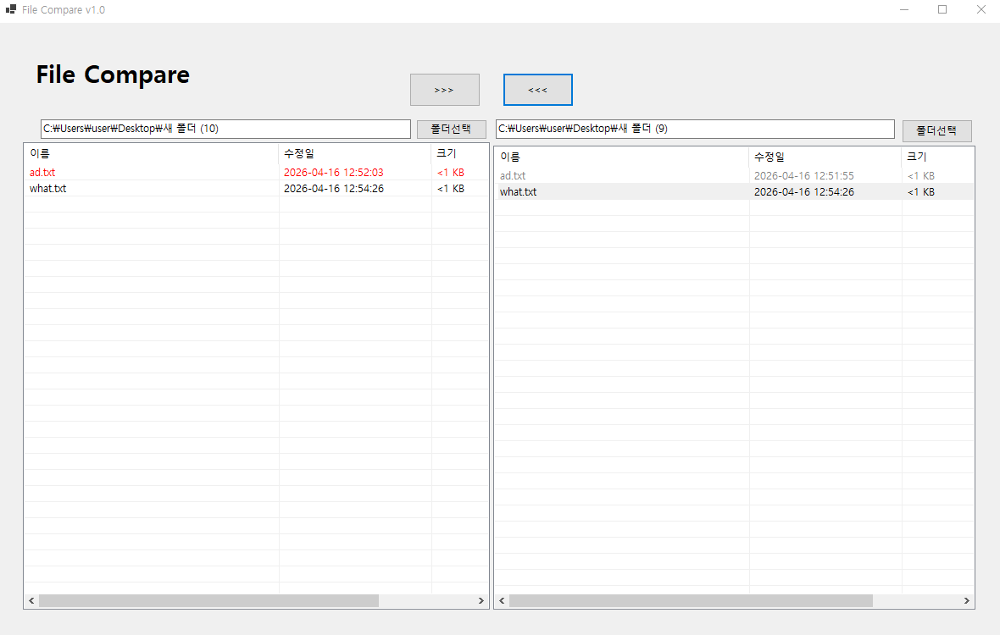

# (C# 코딩) 파일 비교 툴

## 개요

- **C# 프로그래밍 학습**
- **1줄 소개**:
    - 폴더 브라우저를 통해 경로를 선택하고, 파일 목록을 비교하여 동기화할 수 있는 관리 도구입니다.
- **사용한 플랫폼**: 
    - C#, .NET Windows Forms, Visual Studio 2022, GitHub
- **사용한 컨트롤**: 
    - `SplitContainer`, `Label`, `TextBox`, `ListView`, `Button`, `FolderBrowserDialog`
- **사용한 기술과 구현한 기능**:
    - **UI 디자인**: `SplitContainer`를 활용한 좌우 분할 화면 구성
    - **폴더 선택**: `FolderBrowserDialog`를 이용한 로컬 디렉터리 경로 탐색 및 획득
    - **경로 표시**: 선택된 경로를 `TextBox`에 실시간으로 업데이트
    - **ListView 상세 표시(목록 헤더)**: 좌/우 `ListView`에 "이름", "수정일", "크기" 컬럼을 추가하고 `View = View.Details`로 설정하여 헤더와 각 항목의 컬럼이 보이도록 구현했습니다. (`FullRowSelect`, `GridLines` 설정 포함)
    - **항목 자동 채우기**: 폴더 선택 시 파일 목록을 자동으로 읽어와 항목을 채우는 `PopulateListView(ListView, string)` 헬퍼 메서드를 추가했습니다. 각 항목은 파일명(Name), 최종수정일(LastWriteTime, yyyy-MM-dd HH:mm:ss), 파일크기(Bytes)를 SubItem으로 표시합니다.

## 실행 화면 (과제1)

-과제1 코드의 실행 스크린샷

- **구현한 내용**:
    - UI 디자인 및 배치: SplitContainer를 중심으로 좌우 대칭형 구조를 설계하고, Label, Button, TextBox, ListView 등 주요 컨트롤을 가이드에 맞춰 배치했습니다.
     
    - 컨트롤 명명 규칙 준수: 각 컨트롤의 역할을 명확히 알 수 있도록 txtLeftDir, btnLeftDir, lvwLeftDir 등 지정된 변수명을 부여했습니다.
     
    - 폴더 선택 기본 로직: FolderBrowserDialog를 호출하여 사용자가 비교할 대상 폴더를 로컬 디렉터리에서 탐색하고 선택할 수 있는 기능을 구현했습니다.

    - **UI 구성**: `SplitContainer`를 활용하여 좌측 폴더와 우측 폴더의 정보를 독립적으로 보여줄 수 있는 영역을 확보하고 시각적으로 그룹화했습니다.
     
    
     
## 실행 화면 (과제2)

-과제2 코드의 실행 스크린샷
 

-**구현한 내용**:
   - **사용자 편의 로직**: `Directory.Exists`를 활용하여 이미 경로가 입력되어 있는 경우, 해당 폴더 위치에서 탐색창이 시작되도록 설정하여 사용자 편의성을 높였습니다.

   - **폴더 선택 기능**: `btnLeftDir` 및 `btnRightDir` 버튼 클릭 시 폴더 탐색창이 열리며, 선택된 경로는 실시간으로 `txtLeftDir`와 `txtRightDir`에 업데이트되도록 구현했습니다.
    
   - ListView 상세 보기 설정: 좌우 `ListView` 컨트롤에 "이름", "수정일", "크기" 컬럼을 추가하고, `View` 속성을 `View.Details`로 설정하여 각 항목의 세부 정보를 열 형태로 표시하도록 구현했습니다. 또한, `FullRowSelect`와 `GridLines` 속성을 활성화하여 사용자 인터페이스의 가독성과 편의성을 향상시켰습니다.
    
   - 항목 자동 채우기 기능: 폴더 선택 시 해당 디렉터리 내의 파일 목록을 자동으로 읽어와 좌우 `ListView`에 항목을 채우는 헬퍼 메서드 `PopulateListView(ListView, string)`를 추가했습니다. 각 항목은 파일명(Name), 최종수정일(LastWriteTime, yyyy-MM-dd HH:mm:ss), 파일크기(Bytes)를 SubItem으로 표시하여 사용자가 파일 정보를 한눈에 파악할 수 있도록 했습니다.

## 실행 화면 (과제3)

-과제3 코드의 실행 스크린샷
 

 

-**구현한 내용**:

   - **파일 비교 로직**: `CompareDirectories(string leftPath, string rightPath)` 메서드를 구현하여 좌우 폴더의 파일 목록을 비교하는 기능을 추가했습니다. 이 메서드는 각 폴더의 파일 정보를 `Dictionary<string, FileInfo>` 형태로 저장하여 파일명(Name)을 키로 사용하고, 최종수정일(LastWriteTime)과 파일크기(Bytes)를 값으로 저장합니다. 
   
   - **비교 결과 표시**: 비교 결과에 따라 `ListView` 항목의 색상을 변경하여 사용자가 파일 상태를 쉽게 파악할 수 있도록 했습니다. 예를 들어, 동일한 파일은 검은색, 변경된 파일은 빨간색, 오래된 파일은 회색으로 표시됩니다.
   
   - - **실시간 비교 업데이트**: 폴더 선택 시마다 `CompareDirectories` 메서드를 호출하여 실시간으로 비교 결과가 업데이트되도록 구현했습니다. 이를 통해 사용자는 폴더를 선택할 때마다 즉시 파일 상태를 확인할 수 있습니다.

## 실행 화면 (과제4)
- **코드의 실행 스크린샷과 구현 내용 설명**

- (과제 4 진행 후 내용을 업데이트하세요.)

